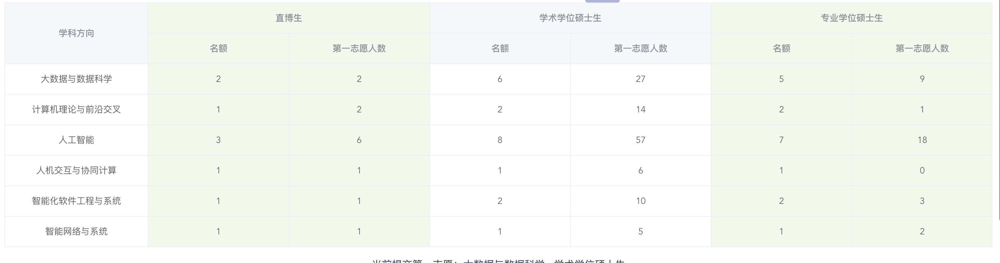
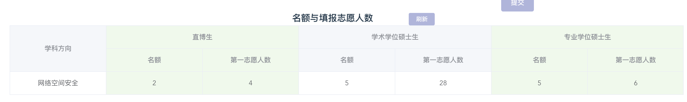

2020年，由于疫情的原因以及中美关系的原因，很多准备出国的CS学生们最后选择了推免，内卷越来越严重。在暑期夏令营包括九月预推免的过程中，我的心态心智各方面都发生了很大的变化，在这里把我的经历和想法都分享给大家，希望给后来者们一些帮助吧。

<!-- more -->

# 推免之路

## 个人情况

## 夏令营

我申请了很多学校的夏令营，由于都是线上举办的原因，所以今年大部分同学的夏令营都是海投（往年虽然也很多海投，但是冲突的夏令营还是要有所选择），这可能也导致了夏令营比想象中的艰难特别多，给我前期的心理带来了特别大的影响，一度导致我心态崩溃。
夏令营申请了的有：清华计算机系与网络科学与网络空间研究院夏令营（入营参加，能够直接参与预推免复试）、清华深圳国际研究生院计算机学科夏令营（入营未参加）、南大本科生开放日（入营未参加），人大信息学院（未入营），计算所网数实验室（入营，学硕offer），自动化所（入营未参加），软件所（入营未参加），复旦计算机（志愿是大数据学硕，候补，fdu秀的很）。北大叉院（未入营），北大信科（未入营），北航（学硕offer，后面放弃了）。

北大全聚德（全拒得）。我没有想到今年形式这么难，材料填的比较草率，没联系导师。后面联系的时候，信科说只收直博的，当时我想除了大清的博其他博我都不考虑，然后也懒得联系导师了，就混过去了。并且据前辈们讲，北大对鄙校好像有一些限制，说是因为之前有几年鸽子很多，这个消息就不清楚了）。不过北大来讲的话，信科夏令营只收直博生，发的也是直博的offer。我觉得北大导师捞人能力还是很强的吧，包括学硕，应该话语权比较大。叉院的话，鄙校只有一个同学去了，他联系的是信科的一个导师，导师建议他报软微或者叉院，信科外校比较困难（即使他是本专业成绩rk1，综合rk2）。据他说只有面试，没有机试，面了一些数学和专业课。信科还好一些，收了很多外校的，因为直博比较多。叉院看了一下名单，多于60%都是北大本科的学生。那个同学一开始在waiting list里，后面没过几天不知道什么原因（可能是扩招了？），上了优营，成功上岸。

人大信息学院：就离谱，人大没入营，我报的不是高瓴都没过。感觉可能是overqualified？或者我材料没认真填的原因？人大申请表还要学院院长签字盖章，就离谱。人大因为入营出来的很早，我没入营心态直接崩溃，以为今年竞争激烈成我人大都去不了了，然后当天晚上就报了北航夏令营（一开始北航没报，想着肯定能拿计算所offer，用计算所保底来着），经历了人大没入营，改成了本校保底，冲计算所和北航了。不过最后发现竞争没有那么激烈。

复旦计算机：复旦CS的话，NLP比较出名，安全据同学说也还可以。其他方向就......学科排名还不如鄙校，只不过综合排名高些，出名一些。复旦的夏令营极其奇葩，是我见过唯一一个需要填志愿的夏令营。而且我也没有拿到offer。我都没拿到复旦的offer，而且还不是nlp和牛导。我是真的服气。

### 南大开放日（入营未参加）

南大的夏令营是一个叫开放日的东西，申请很简单，只需要在网页上填表就可以了，之前并没有联系导师。材料审核完了，会发短信进行通知。因为我个人没有很强的科研意向，以及不太想去南京，另外就是南大其他组的光辉感觉都被LAMDA掩盖了，而且南大相对上交、浙大CS的title较差一些。所以最终入营了没有参加。入营在6.28日收到了短信通知。南大的LAMDA组应该是国内最顶尖的offer了，如果有科研志向并且对该方向感兴趣的同学需要提前联系LAMDA组的老师，组内也有面试。有些保研朋友们说LAMDA硕士50w打包价。

### 清华大学计算机系与网络科学与网络空间研究院夏令营
本部夏令营，清华大学我最终参与的也是这个夏令营，由于疫情原因，本次夏令营只有介绍环节与机试环节。贵系和网研院一同举办，流程都是一样的。介绍实验室的研究方向啥的。一般来讲，留给外校的名额较多的是高性能所和网络所的直博）。学硕推免也会给几个，但是竞争极其激烈。由于疫情原因，这次夏令营没有面试环节只有机试。机试题目是一条签到，一条模拟，一条图论题，共计300分。今年的情况是：签到题基本人人都A了，我个人的话不太喜欢做模拟题。比赛的时候模拟题都是队友完成的（因为我十分不喜欢做这种细节+体力方面的事情）。所以我模拟题做的比较崩溃，最后拿了60分。凸轮题最后半小时的时候看了一下，用了个DFS+可回退并查集骗了28分。最后188分滚粗。今年的话，题目较难一些。前50%据说线应该是120+左右，所以机试比较菜的人还是大有人在。我主要模拟做的比较差。夏令营机试排名前50%的话，只要在预推免系统中递交材料就能够进入清华贵系或者网研院的预推免复试（也就是不用初审，不过感觉一点用都没有）。然后夏令营的机试成绩能够抵预推免的机试，也就是可以不参加预推免的机试，但是如果参加预推免的机试，机试成绩就要使用预推免的）。网上说的对，夏令营更多的话提供的是一个和贵系老师交流接触的途径，如果能够拿到贵系老师的口头offer，并且最终确定要你的话，一般来讲没有太大的问题。今年最终选择去清华贵系参加预推免的并不是很多，好像也就40个人不到。

### 清华大学深圳国际研究生院计算机学科夏令营

### 复旦计算机夏令营

入营的应该都是985/211 rank前三吧，而且感觉还要竞赛或者paper。复旦可能对北方院校不太认同？鄙校软件工程专业成绩rk1的没有入营。鄙校应该就只有我一个人入营了。

复旦夏令营入营的同学还送了一个大红色的纪念T恤，一个本子（看上去很古老了，2017-2022年的日历，感觉是库存）还有一支笔。和其他学校一样第一天整宣传，介绍实验室啥的。

- 机试：今年机试不算分，2小时3题，交一个解题报告。题目很简单，闭着眼睛也能做。 <a :href="$withBase('/resources/fdu-summer.pdf')">机试题目</a>

- 英语面试：首先自我介绍，然后挑自我介绍里的一些东西说，最后问我有没有报上交，为什么没报上交，他那边的网络及其卡顿，麦也不好，差评。
- 专业面试：感觉老师水平不行，看了打了acm就问我算法，问我知不知道DP。然后问我走最短路径这种问题我怎么写？我说最简单基础的DFS/BFS。可以djikstra，bellman，SPFA，floyd。如果较为复杂的话或许还可以使用A\*寻路。然后他问我A\*算法是啥，让我用DP。整场面试完，我面的感觉不好，并且我感觉我对那个面试老师的印象也很差，感觉没什么水平。我觉得她不能准确的把题目的意思介绍给我，我觉得她可能是看过啥类似的题目，但是没有完全记住，支支吾吾说不出来。

计算机志愿以及名额个数，据说是优先满足第一志愿，所以学硕满了的话也不会和专硕竞争，也就是说。只有填专硕的没满才会有学硕调剂成专硕。

同学也分享了安全方面的志愿人数。

我感觉在复旦面试中表现不好，同时复旦面试我的老师也是我觉得我面过的几个学校里面试我的老师水平最难以描述的。

另外，为了避免竞争，我报的是大数据方向的学硕（fdu计算机在张江，且专硕学费贵，不分配宿舍）。没有选择NLP方向，然后过了7天，收到了候补的邮件。（难以吐槽，我寻思要是拿到offer的都比我厉害的话，他们为啥要去复旦，不去上交试试）。